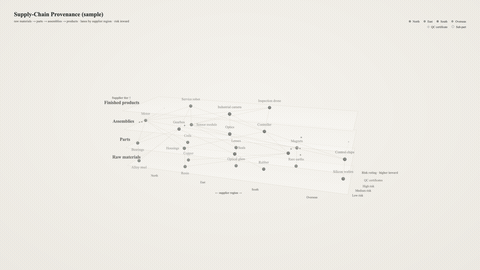
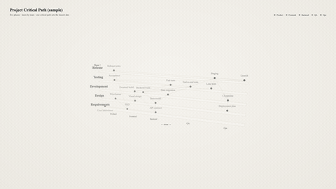
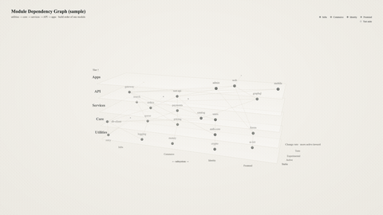
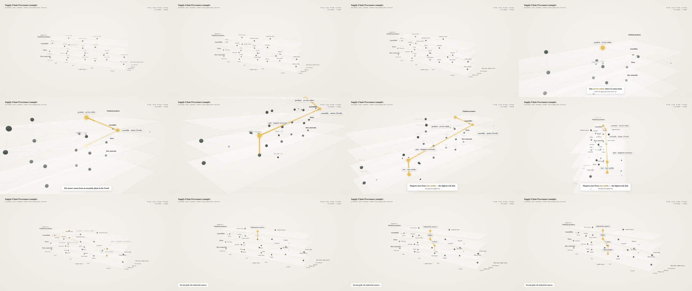
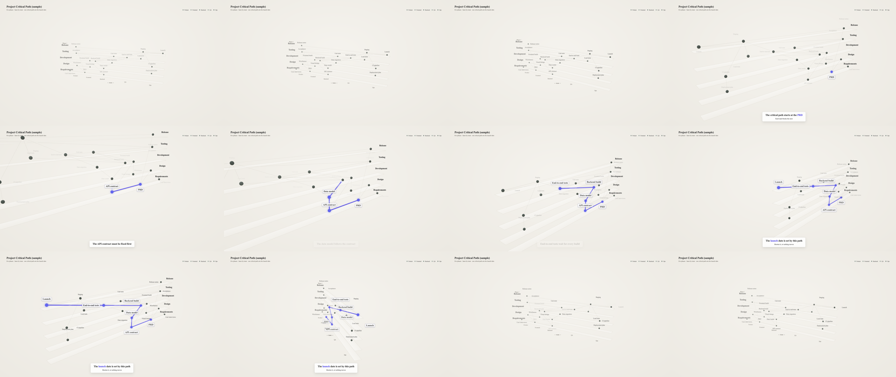
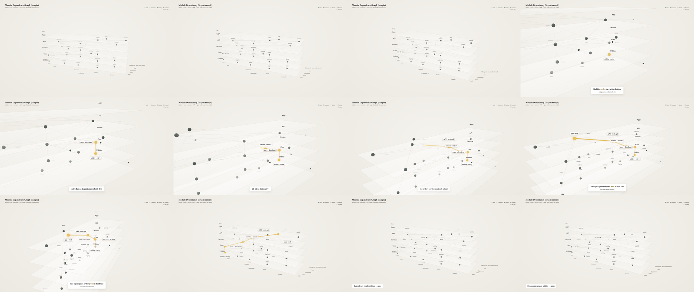

# Roadmap 3D Video

<sub>package: <code>roadmap3d</code></sub>

[](CHANGELOG.md) [](LICENSE) [](package.json) [](docs/licenses.md)

**Turn a roadmap — layers plus dependencies — into a 20–30 s 3D explainer video in which one path lights up.**

- **You give it** one JSON file: layers, groups, edges, the path to highlight, captions.
- **You get** an MP4, a GIF preview, a cover PNG and a 2D strip.
- **Use it for** a learning/skill roadmap, supply-chain traceability, a project's critical path, software module dependencies.

```bash
npm install && npx playwright install chromium && scripts/get_fonts.sh    # once
node src/cli.mjs test   examples/supply-chain/roadmap3d.json -o out/demo    # key frames to look at first
node src/cli.mjs render examples/supply-chain/roadmap3d.json -o out/demo    # needs ffmpeg (PATH, $FFMPEG or pip install imageio-ffmpeg)
```

Built for people and coding agents — see [SKILL.md](SKILL.md) / [prompts/](prompts/).

**Keywords:** roadmap · 3D · knowledge graph · dependency graph · critical path · supply chain · data visualization · graph visualization · animation · three.js · video generation · JSON · headless rendering · agent skill

[中文说明 →](README.zh-CN.md) · **Showcase:** *(reserved — see [Showcase](#showcase))*

| Supply chain · `ivory-gold` (depth axis, sub-parts, certificates) | Project critical path · `ivory-indigo` (flat) | Module dependencies · `ivory-gold` (test suites as leaves) |
|---|---|---|
|  |  |  |
|  |  |  |

Full-length videos (1080p MP4, about 20 s each): see [Releases → v1.0.0](https://github.com/pengmengying2025/roadmap3d/releases/tag/v1.0.0).

## How it works

Layers, groups, an optional depth dimension, edges, *one highlight path that lights up*, camera keyframes, bilingual captions — all read from the JSON spec. The scene is built with three.js and rendered headlessly in Chromium (driven by Playwright), frame by frame; ffmpeg encodes the frames into the MP4 and the GIF preview, and the cover PNG is the frame where the first path node lights up. Nothing is simulated, so the same spec always gives the same video.

## What it does

- **Layout from data, not from a force simulation.** Every node names its *layer* (tier, phase, level…), its *group* (region, team, subsystem…) and optionally a *depth* level (risk, change rate, priority…). The engine stacks layers as floors (y), puts groups in lanes (x) and depth inward (z). Nothing is simulated, so the picture is stable and explainable.
- **The highlight path.** `highlight.path` lists the nodes that light up, in order: each one brightens, grows, gets a halo and a label; a tube grows along each edge. A second path can follow in the tail.
- **Camera as data.** `camera: "auto"` derives an overview → push-in → walk-the-path → pull-back sequence from the path; or write keyframes with semantic targets (`node:ID`, `mid:A,B`, `path`, `center`).
- **Captions on the timeline**, bilingual text fields (`{"zh": …, "en": …}`), a brand line, a legend and a small tail line — all from the spec.
- **Visual presets** — `ivory-gold` (default: ivory ground, grey-green nodes, a gold path), `ivory-indigo` (same ground, indigo path), and three dark ones — `slate-gold`, `midnight`, `obsidian-gold`. Every colour and glow parameter lives in one JSON each; override any key inline or inherit with `"base"`.
- **Quiet typography.** Serif throughout (Times New Roman → Source Serif 4 → Georgia; Noto Serif SC for CJK), small and regular-weight: node labels 14 px, path labels 20 px, captions 22 / 15 px at 1080p.
- **One command each**: `validate`, `test` (key frames to look at), `render` (video + GIF + cover + contact sheet), `still`, `cover`, `strip` (2D band of the path for slides and documents).

## Install and run (full)

```bash
npm install                      # three + playwright
npx playwright install chromium  # headless browser (once)
scripts/get_fonts.sh             # Source Serif 4 + Noto Serif SC (OFL) → fonts/  (any font dir works: --font-dir)
# ffmpeg: put it on PATH, or export FFMPEG=/path/to/ffmpeg, or `pip install imageio-ffmpeg`

node src/cli.mjs validate examples/deps/roadmap3d.json
node src/cli.mjs test     examples/deps/roadmap3d.json -o out/deps     # key frames → look at them first
node src/cli.mjs render   examples/deps/roadmap3d.json -o out/deps     # video.mp4 · preview.gif · cover.png · contact.png · timeline.json
node src/cli.mjs strip    examples/deps/roadmap3d.json -o out/deps     # strip.png
```

Node ≥ 18. Rendering runs at about 3–5 frames/s at 1080p on a laptop (software GL); a 20 s clip takes 2–3 minutes.

## The spec in one screen

```jsonc
{
  "meta":   { "title": {"zh": "…", "en": "…"}, "preset": "ivory-gold", "duration": 21, "lang": "en" },
  "axes":   { "layer": {"label": {"en": "Supplier tier ↑"}}, "group": {"label": {"en": "← region →"}},
              "depth": {"label": {"en": "Risk"}, "levels": [{"id": 1, "label": {"en": "Low"}}, {"id": 2, "label": {"en": "High"}}]} },
  "layers": [ {"id": "raw", "label": {"en": "Raw materials"}}, {"id": "parts", "label": {"en": "Parts"}}, … ],      // bottom → top
  "groups": [ {"id": "north", "label": {"en": "North"}}, … ],
  "nodes":  [ {"id": "r-rare", "label": {"en": "Rare earths"}, "layer": "raw", "group": "overseas", "depth": 2},
              {"id": "a-motor-k1", "label": {"en": "Stator"}, "layer": "asm", "kind": "minor", "parent": "a-motor"},
              {"id": "c-rare", "label": {"en": "Rare earths · cert."}, "layer": "raw", "kind": "leaf", "parent": "r-rare", "state": "live"} ],
  "edges":  [ {"from": "r-rare", "to": "p-magnet"} ],                                  // kind: dep (default) | link; parent spokes are automatic
  "highlight": { "path": ["f-robot", "a-motor", "p-magnet", "r-rare"], "lit_at": [4.6, 6.0, 7.4, 8.8], "release_at": 13.5,
                 "labels": {"r-rare": {"en": "raw · rare earths"}} },
  "camera": "auto",                                                                     // or [{t, az, el, r, target}, …]
  "captions": [ {"a": 3.8, "b": 5.8, "main": {"en": "One *service robot*: where it comes from"}, "sub": {"en": "Follow the supply chain down"}} ],
  "overlays": { "legend": {"kinds": {"leaf": {"en": "QC certificate"}}}, "tail": {"a": 14.2, "text": {"en": "Second path: the camera"}} }
}
```

Full field reference: [schema/roadmap3d.schema.json](schema/roadmap3d.schema.json) (JSON Schema draft-07; comments and trailing commas are tolerated in spec files). Node kinds: **major** (sphere on the grid), **minor** (small sphere in a half-ring in front of its parent — sub-items, components), **leaf** (octahedron on the leaf plane — tests, certificates, documents). Edge direction is `from → to` = "`to` depends on `from`" (earlier → later, supplier → customer).

## Commands

| command | output | notes |
|---|---|---|
| `validate spec` | exit 0/1 + messages | references, timing monotonicity, caption windows, text length, language coverage |
| `info spec` | `timeline.json` | resolved lanes, bounds, auto-camera keyframes, lit times (needs a browser) |
| `test spec -o dir [--times a,b]` | `test_<t>.png` per key moment | **always look at these before rendering**: far shot (t=0.5), each lit moment, each caption, the last frame |
| `render spec -o dir [--fps 30 --crf 18 --keep-frames --no-video --no-gif]` | `video.mp4`, `preview.gif` (480 px, 10 fps), `cover.png` (the frame where the first path node lights up), `contact.png` (12 tiles), `timeline.json` | frames are deleted after encoding unless `--keep-frames` |
| `still spec -o dir --t 10.6 [--dpr 2]` | one hi-res frame, overlays hidden | for slides and documents |
| `cover spec -o dir --t 10.6` | same, everything but the path dimmed | poster frame with the path only |
| `strip spec -o dir [--second --reverse --width 1500]` | `strip.png` | 2D band of the highlight path |

Global options: `--lang zh|en`, `--preset ivory-gold|ivory-indigo|slate-gold|midnight|obsidian-gold|file.json`, `--font-dir DIR`, `--ffmpeg PATH`.

## Presets and the visual rules

| preset | ground | nodes | highlight path | use it for |
|---|---|---|---|---|
| `ivory-gold` (default) | #F5F3EE → #ECE9E2, no vignette; white 40 % layer panels with a #D9D4C8 outline | grey-green #8C9A92 | gold #E3B94A with a soft band; lit nodes #EBC25B, 1 px #C99A2E outline, two normal-blended halos (1.6× and 2.6×); small bright spark #FFF1B8 | reports, documents, decks on white, product video — the default |
| `ivory-indigo` | same as ivory-gold | same | the same construction on an indigo scale (#4F46E5 path, #6366F1 fill, #3730A3 outline) | the same, when gold is the wrong signal |
| `slate-gold` | #1F2532 → #2B3345 soft radial gradient, light vignette | cool grey #9AA4B8 | gold #E8B84A, soft additive glow, thin gold outline | dark decks and product video |
| `midnight` | #0B1020 → #111A33 radial gradient + vignette | grey-blue #8FA3C8 | electric cyan #22D3EE, additive glow | dark product video that wants more punch |
| `obsidian-gold` | #0A0A0C | neutral grey #6B6B73 | warm gold #E5B84B, additive glow | keynotes on black, finance / premium contexts |

All of them follow the same four rules — quiet ground (ivory or dark), low-saturation nodes, a saturated glowing path, low-alpha edges — plus gradient layer panels with a thin outline, depth fog, a spark that runs along each edge as the path lights up, rounded label boxes with a soft shadow, and a cover frame taken at the moment the first node lights. The reasoning, one comparison image per preset, and what was tried and dropped are in [docs/visual.md](docs/visual.md). To tweak: copy a preset, change keys, pass `--preset my.json` (or set `meta.preset` to an object with `"base": "ivory-gold"` — that is exactly how `ivory-indigo` is defined). Lit nodes grow only 1.15×; the path is a thin tube; halos are small — the path reads by colour, not by size. Everything that lights up (fills, tubes, halos, spark, outline) is unlit and unfogged, so the colour on screen is the preset colour; ordinary nodes stay shaded. Light presets glow with normal-blended halos because additive glow clips to white on an ivory ground — see [docs/visual.md](docs/visual.md) §4.

## Type

One serif stack for everything: `"Times New Roman", "Source Serif 4", Georgia, serif`, with `Noto Serif SC` as the CJK fallback. Times New Roman is used where the machine has it (macOS, Windows); Source Serif 4 (OFL, fetched by `scripts/get_fonts.sh`) is the portable stand-in, so Linux CI renders look the same as a laptop apart from that one face. Sizes at 1080p: layer titles 18 px semibold, node labels 14 px, path labels 20 px semibold (30 px in `cover`), captions 22 / 15 px, legend and axis labels 12 px; tracking slightly tight. Override in the spec with `meta.fonts.family` (Latin list), `meta.fonts.cjk`, `meta.fonts.scale` (one multiplier) or `meta.fonts.sizes` (per role); other output sizes scale with `meta.size` automatically.

## Examples

- `examples/supply-chain/` — four supplier tiers as layers, four regions as lanes, risk rating as depth; sub-parts as minor nodes, QC certificates as leaf nodes; the highlight path follows one finished product down to its raw material, a second path follows another product in the tail. `ivory-gold`.
- `examples/critical-path/` — five project phases as layers, five teams as lanes, no depth; the highlight path is the critical path that sets the launch date; explicit camera keyframes keep the top layer titles in frame. `ivory-indigo`.
- `examples/deps/` — five architecture tiers as layers, four subsystems as lanes, change rate as depth, test suites as leaf nodes; the highlight path is the build order of one module, bottom-up. `ivory-gold`.

All three are synthetic and render in English by default; Chinese strings are kept in the specs as an optional localisation (`--lang zh`). Each folder has the spec and a `render/` directory with `preview.gif`, `cover.png`, `contact.png` and `timeline.json`; the full-length `video.mp4` files are attached to [Release v1.0.0](https://github.com/pengmengying2025/roadmap3d/releases/tag/v1.0.0) rather than committed (`render` writes them locally as usual).

## For agents

[SKILL.md](SKILL.md) is an Agent Skills file: when to use this tool, what to ask the user, the validate → test → review → render workflow, the pitfalls. [prompts/en](prompts/en) and [prompts/zh](prompts/zh) hold two paste-ready templates: build a graph from scratch, and change the path/captions/palette of an existing one.

## Troubleshooting

- **Engine never becomes READY** → a JS error in the page or a font that never loads; the CLI prints captured page errors. Check the spec with `validate` first.
- **WebGL fails in headless Chromium** → the CLI already passes `--use-gl=angle --use-angle=swiftshader --enable-unsafe-swiftshader --ignore-gpu-blocklist`; on Linux CI make sure the Playwright Chromium dependencies are installed (`npx playwright install-deps chromium`).
- **CJK labels show as boxes** → no CJK font found; run `scripts/get_fonts.sh` or pass `--font-dir`. The CLI warns when fonts are missing.
- **Labels overlap in the cover frame** → pick another `--t`, or shorten `highlight.labels`. Label placement tries three rings of candidate positions and then clamps to the screen.
- **A depth-axis label collides with the legend or the grid** → the axis title is placed on the extension of the level ticks; hide the legend with `overlays.legend=false` or shorten the title. Always check both the far frame (t≈0.5) and a near frame.
- **Colour edits leave old colours behind** → colours live only in the preset JSON; grep the preset, not the engine.
- **A layer title is cut by the frame** → titles fade out as they reach the frame edge; if one keeps disappearing, widen the push-in (`r: "0.5"`) or aim between two nodes (`mid:A,B`) as `examples/critical-path` does.
- **Long renders** → run `render` under `nohup … &` and watch the log; the CLI prints progress every 60 frames.

## Showcase

*(reserved)*

## License

MIT. Dependency licences (three.js MIT, Playwright Apache-2.0, ffmpeg called as an external process, Source Serif 4 and Noto Serif SC OFL downloaded on demand) are listed in [docs/licenses.md](docs/licenses.md).
