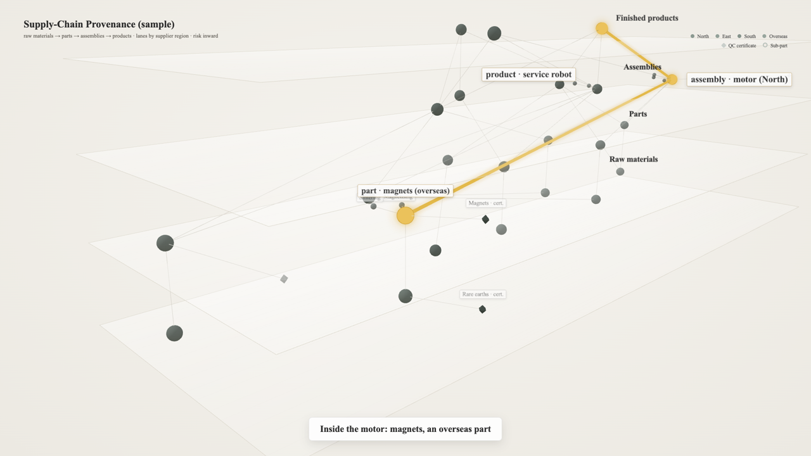
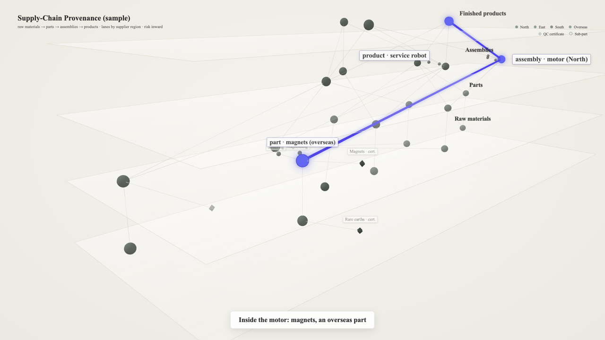
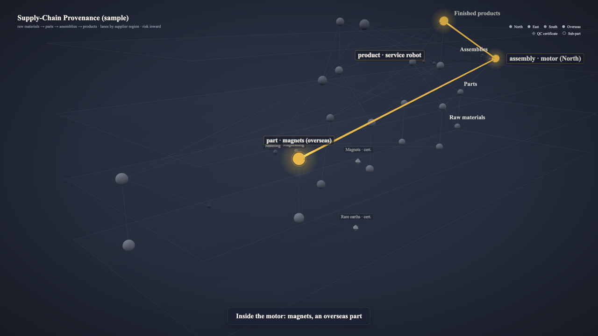
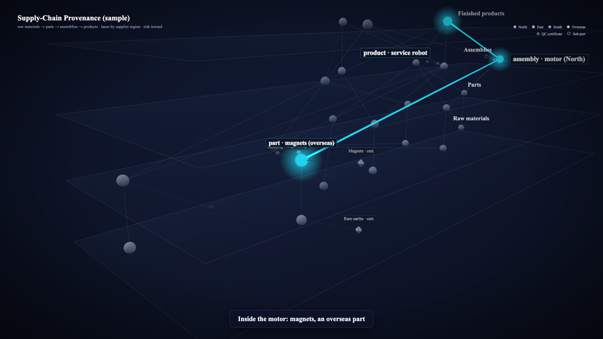
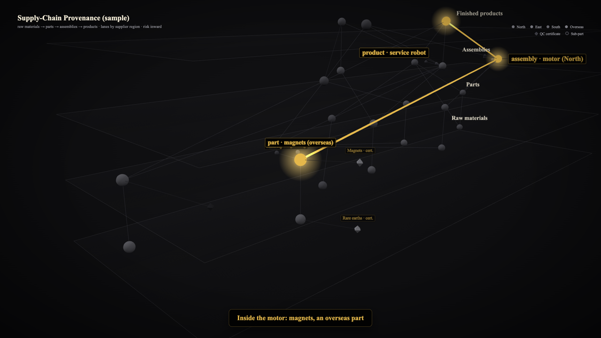

# Visual guide — why the path lights up

Five presets ship with roadmap3d — two ivory (light) ones and three dark ones. They differ in mood, not in method: each applies the same four rules, the same type rules, and the engine adds the same finishing touches on top. 中文版在下半部分。

## 1. The four rules

| rule | what it means in the preset | why |
|---|---|---|
| **1. Quiet ground** | `bg` is a low-chroma colour with a slight radial gradient: ivory #F5F3EE → #ECE9E2 without a vignette on the default, deep slate / blue / black with a vignette on the dark presets | the path can only be the most saturated (on ivory) or the brightest (on dark) thing if the ground is quiet |
| **2. Low-saturation nodes** | `node.tints` are grey-green / cool grey / charcoal with tiny per-group shifts; minor nodes paler (ivory) or darker (dark), leaf nodes at 0.72 | nodes must read as *structure*, never compete with the path |
| **3. One saturated path, by colour not by size** | `lit.node / glow / tube` share one hue (deep gold, indigo, cyan); lit elements are unlit (no shading, no fog), so the colour on screen is the preset colour; lit nodes grow only 1.15× and get a 1 px outline (`lit.ring`); on ivory the glow is two normal-blended halos plus a soft band along the path, on dark it is one additive halo; tubes are thin; a bright spark travels each edge | saturation is the only place the eye is invited to go; a big glowing blob would hide the structure it sits in |
| **4. Low-alpha edges** | `edge.*_opacity` 0.25–0.6 in a colour close to the ground (#B8B3A8 at 0.45 on ivory) | the mesh stays legible as texture but never as lines you count |

Never add a second accent hue. If something else must stand out (a second path, a group), use the same hue at lower intensity or wait for the tail.

## 2. Type

One serif stack for everything — labels in the scene, captions, brand line, legend, strip:

```
"Times New Roman", "Source Serif 4", Georgia, serif   +   "Noto Serif SC" (CJK fallback)
```

Times New Roman is used where the rendering machine has it (macOS, Windows); Source Serif 4 (OFL, fetched by `scripts/get_fonts.sh`) is the portable stand-in, so a Linux CI render differs from a laptop render in that one face only. Chinese strings fall through to Noto Serif SC.

| role | px at 1080p | weight | where |
|---|---|---|---|
| layer titles | 18 | 600 | left edge of each floor |
| path (lit) labels | 20 (30 in `cover`) | 600 | boxed, placed beside the lit node |
| caption main / sub | 22 / 15 | 600 / 400 | bottom-centre box |
| brand title / subtitle | 24 / 13 | 600 / 400 | top-left |
| tail line | 20 | 600 | bottom-left box |
| node labels (wide shot), minor / leaf labels | 14 | 400 | beside the node; minor / leaf labels boxed, near the camera only |
| legend, axis titles, lane and level names | 12 | 400 (titles 600) | top-right; along the axes |

Tracking is slightly tight (−0.01 em). Every 3D label keeps a constant on-screen size whatever the camera does, so the wide shot and the close-up carry the same type. Layer and axis titles fade out as they reach the frame edge rather than being cut in half. On the ivory presets every text role was checked against WCAG AA: charcoal #2B2B2B on the ground or on a white card is ≥ 12:1, the 12 px axis / legend greys are ≥ 5.8:1, and the caption accent is a darker gold (#92701A, 4.5:1) than the path gold #D4A93E, which at 2.2:1 is fine for a line or a node but not for 22 px text. If it looks too small, shorten the text — do not scale it up; `meta.fonts.scale` and `meta.fonts.sizes` exist for other output formats, and everything scales with `meta.size` automatically. Label canvases are drawn at 2 × their on-screen size (× device pixel ratio) and mip-mapped, so 14 px serif stays crisp in the MP4 and in a 2× `still`.

## 3. The five presets

Same spec, same frame (`examples/supply-chain`, t = 8.0 s), five presets:

| | |
|---|---|
| **ivory-gold** (default) · `presets/ivory-gold.json` — ground #F5F3EE → #ECE9E2 with no vignette, white 40 % layer panels with a #D9D4C8 outline, nodes grey-green #8C9A92 (minor paler, leaf 0.72), edges #B8B3A8 at 0.45; path gold #E3B94A with a soft band along it (rgba 214,164,60 at 0.22) and a small bright #FFF1B8 spark; lit nodes filled #EBC25B with a 1 px #C99A2E outline and two halos — inner rgba(232,196,98,0.45) at 1.6 × the node radius, outer rgba(214,164,60,0.18) at 2.6 ×; charcoal #2B2B2B labels on white cards (rgba 255,255,255 at 0.88, thin border, small corners, light shadow); caption accent dark gold #92701A. For reports, documents, decks on white, product video — the default. |  |
| **ivory-indigo** · `presets/ivory-indigo.json` — the same ground and nodes, the same construction on an indigo scale: path #4F46E5, fill #6366F1, outline #3730A3, halos rgba(129,140,248,0.45) and rgba(99,102,241,0.18), band rgba(99,102,241,0.22), spark #E0E7FF, accent #4F46E5. Defined as `"base": "ivory-gold"` plus the hue keys. For the same uses when gold is the wrong signal. |  |
| **slate-gold** · `presets/slate-gold.json` — ground #1F2532 → #2B3345 with a light vignette, nodes cool grey #9AA4B8, path gold #E8B84A with a soft additive halo and a thin gold ring, ivory labels on translucent slate boxes. For dark decks and product video. |  |
| **midnight** · `presets/midnight.json` — ground #0B1020 → #111A33, nodes grey-blue #8FA3C8, path electric cyan #22D3EE at full additive glow, glass labels. For dark product video that wants more punch. |  |
| **obsidian-gold** · `presets/obsidian-gold.json` — ground #0A0A0C, nodes neutral grey #6B6B73, path warm gold #E5B84B, black label boxes with gold text. For keynotes on black, finance and premium contexts. |  |

## 4. Light grounds: why not additive glow — halos instead

On a dark ground a glow is *added light*: additive blending raises the pixels around a lit node, and a raised pixel on slate or black reads as light. On an ivory ground there is almost no headroom left. The ground is about #F0EEE7; adding the inner-halo gold (232,196,98) at 45 % gives (344,326,275), which clips to pure white #FFFFFF. The glow turns into a white smudge, the gold is gone, and the node looks washed out rather than lit.

So on light grounds "lit" has to be said with colour, not with brightness:

| | additive (dark-preset method) | normal blending (ivory method) |
|---|---|---|
| ivory ground #F0EEE7 + rgba(232,196,98,0.45) | #FFFFFF — clipped to white | #ECDBAB — a warm cream around the node |
| slate ground #2B3345 + rgba(232,184,74,0.5) | #9F8F6A — reads as light | — |

The ivory presets therefore build the glow from normal-blended layers that *tint* the ground toward the path hue:

- **Two halos per lit node** (`lit.halos`): an inner one, denser and close (rgba 232,196,98 at 0.45, radius 1.6 × the node), gives the node a warm edge; an outer one, faint and wide (rgba 214,164,60 at 0.18, radius 2.6 ×), gives the fall-off. Each is a soft disc (`soft` = the fraction of the radius that fades out).
- **A soft band along the path** (`lit.tube_glow`): a camera-facing ribbon, 4 × the tube width, with feathered edges (rgba 214,164,60 at 0.22) — the same idea for the line that the halos are for the node.
- **A 1 px outline** (`lit.ring`, `ring_style: "line"`) in a darker gold #C99A2E, so a small node keeps a crisp edge against a pale halo.
- **Unlit fills**: lit nodes, tubes, sparks, halos and outlines use unlit materials and ignore the fog. Under the scene lights a #E0B455 fill used to render around #957736 at the focus; now #EBC25B renders as #EBC25B. Ordinary nodes stay lit and fogged, which keeps them grey and in the background.
- **The spark stays small and pale** (#FFF1B8, `spark_scale` 0.55): on a light ground the brightest thing possible is near-white, so it is kept small enough to read as a point moving along the gold.

The dark presets keep the additive halo; there it is the right tool.

## 5. Finishing touches (all presets)

- **Layer panels**: each floor is a plane with a gradient alpha (`floor.opacity` near the camera → `floor.opacity_far` at the back) plus a thin outline (`floor.edge_opacity`). On ivory they are white at 40 % with a #D9D4C8 outline — visible bands that hold the tiers; on `slate-gold` they are barely there (0.035). Panels suggest the tier without becoming slabs.
- **Depth fog**: `fog.near / far` are multiples of the overview radius (0.55 / 1.65). Far nodes fade toward the ground colour, which is what gives the scene its depth; keep `fog.color` close to `bg.edge`.
- **Sequential light**: nodes light in `lit_at` order; a tube grows from the previous node during the 0.8 s before each `lit_at`, and a spark (`lit.spark`, `lit.spark_scale`, `lit.spark_opacity`) rides the growth front so the eye follows the edge rather than noticing two nodes turning on.
- **Lit nodes**: grow 1.15× (`lit.grow` = [0.6, 0.15]: minor / leaf nodes a little more, majors 15 %) and are covered by an unlit fill in `lit.node`, so the on-screen colour is exactly the preset colour. Halos: `lit.halos` layers on light presets, or the single `lit.halo_opacity` / `lit.halo_scale` halo on dark ones. With `lit.ring` set, an outline: `ring_style: "line"` draws a true 1 px circle at `lit.ring_scale` × the node radius; the default is a textured sprite ring (`lit.ring_width` in texture px). Ordinary nodes never change size. The tube (`lit.tube_radius` 0.056–0.07) is thin; the spark (`lit.spark_color`, `lit.spark_scale`) is the brightest thing on screen for a moment, then gone.
- **Labels**: canvas sprites with `label.radius` corners (on-screen px), a `label.shadow` drop shadow and a 1 px border (path hue for lit labels, faint for detail labels). Placed in screen space just outside the lit node, with three rings of candidate offsets, clamped to the frame.
- **Cover frame**: `render` writes `cover.png` from the frame where the first path node has just lit (`lit_at[0] + 0.35`), so the poster already shows what the clip is about.
- **HUD**: brand line top-left, legend top-right, one caption at a time bottom-centre (`hud.radius` corners, `hud.caption_em` for the accent colour), a small tail line bottom-left.

## 6. Tried and dropped

| tried | why dropped |
|---|---|
| A single brand-colour palette (deep green ground, cream path) | tied every clip to one brand; cream on green read as "warm" rather than "lit" → neutral presets, one saturated hue each |
| Electric cyan as the default | punchy on a screen, loud in a report; gold on slate reads as "considered" at any size → `slate-gold`, `midnight` kept |
| A dark default | most clips end up in documents, reports and white decks, where a dark frame is a hole in the page → ivory default with the dark presets kept for projection |
| Additive glow on the ivory ground | clipped to white: the halo became a white smudge and the gold vanished → two normal-blended halos + a soft band along the path |
| Shaded (lit) path nodes | the scene lights darkened the fill by about a third (#E0B455 rendered #957736), so hex values in the preset did not match the screen → unlit fills, colour on screen = preset colour |
| Lit nodes at ~3× | the glowing ball hid the tier it sat in and dwarfed its label; at 1.15× with a 1 px outline the node stays part of the structure and the colour does the pointing → 1.15×, smaller halo, thinner tube |
| Path gold for caption accents | #C99A2E was 2.5:1 on a white card (#D4A93E now 2.2:1), below WCAG AA for 22 px text → darker gold #92701A for text only; the path keeps its gold |
| A deep gold #C99A2E path (0.4.0) | lightened one step in 0.5.0 → #D4A93E, with #E0B455 fills and a #EFD27A spark |
| A plain light `paper` preset next to the ivory pair | once `ivory-indigo` existed it duplicated it → removed in 0.5.0 |
| Full-strength halo on the default | the halo hid the node; at 50 % the sphere is visible and a thin ring marks its edge | 
| Sans-serif labels at 23–35 px | the type competed with the graph; serif at 14–20 px sits behind it → one serif stack, 20–25 % smaller |
| Labels sized in world units | huge near the camera, unreadable far away → constant on-screen size for every label |
| Flat background colour | looked like a screenshot; no depth → radial gradient + vignette |
| Uniform floor slabs | slabs competed with nodes → gradient panels with a thin outline |
| All path nodes lighting at once | the story of "from here to there" was lost → sequential light with a travelling spark |
| Pill-shaped labels with no shadow | floated, hard to separate from the mesh → small-radius boxes with a soft shadow and a hairline border |
| Pure white nodes on dark | glare; the path could not be brighter than the field → cool grey / grey-blue tints |
| Thin lines for the lit path | invisible in the wide shot → cylinders with radius |
| A second accent hue for a second path | fights the first; reads as an alarm → same hue, later in time |
| Poster frame from the first frame | nothing lit yet, poster looked empty → frame at first light-up |
| Big explanatory box at the start | nobody reads it; it hides the graph → brand line + legend |
| Normal blending for halos on dark | grey, dirty glow → additive |
| Glow on light backgrounds at full strength | washed the hue out → normal blending at 35 %, thicker tube instead |
| Coral on a light ground | warm and friendly, but bled into the off-white → indigo #4F46E5 |

## 7. Making your own preset

1. Copy the closest preset; keep the key structure (`bg`, `fog`, `floor`, `node`, `edge`, `lit`, `label`, `hud`, `light`, `cover`).
2. Pick one hue family for `lit.*` (tube, fill one step lighter, outline one step darker), `lit.ring` (or drop the key for no ring) and `label.lit_border`; on a light ground use `lit.halos` + `lit.tube_glow` with normal blending, on a dark ground the additive `halo_*` keys; keep `node.tints` desaturated and within one luminance band. Keep `lit.grow` at [0.6, 0.15] — the path is told by colour, not by size. A variant that only changes the hue should be a `"base"` preset like `ivory-indigo`.
3. Label boxes: `label.radius` small (5–8 px), `label.shadow` light (≤ 0.3); `hud.radius` for the caption and tail boxes; `hud.caption_em` for the accent — on a light ground check it reaches 4.5:1 on the caption card (the path hue often does not).
4. `grep` the new file for every hex you replaced — colours live nowhere else.
5. `test` and look at the far frame (t≈0.5), a lit moment, `cover`, and the last frame. Do not change type sizes to fix a layout; change the text.

---

# 视觉指引——路径为什么亮得起来（中文）

## 1. 四条规则
1. **底安静**：`bg` 是低饱和色 + 轻微径向渐变——默认米白 #F5F3EE → #ECE9E2、无暗角；深色三套是板岩 / 深蓝 / 黑 + 暗角。底安静，路径才能是最饱和（米白上）或最亮（深底上）的东西。
2. **节点低饱和**：`node.tints` 是灰绿 / 冷灰 / 炭灰，分组之间只有微小差别；minor 更淡（米白）或更暗（深底）、leaf 0.72。节点是结构，不和路径抢。
3. **路径靠颜色、不靠体积**：`lit.node / glow / tube` 同一色系（金 / 靛蓝 / 青）；点亮的元素不受光照、不受雾，画面颜色就是预设色；点亮节点只放大 1.15× 并加 1 px 描边（`lit.ring`）；米白上是两层普通混合的晕圈 + 路径软衬带，深底是一层加法光晕；管子细；亮点沿边流动。饱和是画面里唯一请眼睛去的地方，大光球只会盖住它所在的结构。
4. **边低 alpha**：`edge.*_opacity` 0.25–0.6，颜色接近底色（米白上 #B8B3A8 @0.45）。网格是质感，不是可数的线。
不加第二强调色。要突出别的东西（第二条路径、某个分组），用同一色相、更低强度，或放到尾段。

## 2. 字体
全篇一套衬线栈——场景标签、字幕、品牌行、图例、横带都用它：`"Times New Roman", "Source Serif 4", Georgia, serif`，中文后备 `"Noto Serif SC"`。机器上有 Times New Roman（macOS、Windows）就用它；Source Serif 4（OFL，`scripts/get_fonts.sh` 下载）是可移植的替身，Linux CI 与笔记本的渲染只差这一个字面。
字号（@1080p）：层标题 18 px / 600；路径标签 20 px / 600（`cover` 里 30）；字幕主句 22 / 600、副句 15 / 400；品牌标题 24、副题 13；尾字 20 / 600；节点标签与 minor / leaf 标签 14 / 400；图例、轴标、车道与层级名 12 / 400（轴标题 600）。字距略收（−0.01 em）。场景里的每个标签在屏幕上保持恒定大小，远景与近景同一套字；层标题与轴标到画面边缘会淡出，不会被裁成半截。米白预设的每种文字都核过 WCAG AA：炭灰 #2B2B2B 在底或白卡上 ≥ 12:1，12 px 的轴标 / 图例灰 ≥ 5.8:1；字幕强调词用比路径更深的金 #92701A（4.5:1）——路径金 #D4A93E 在白卡上只有 2.2:1，画线和节点可以、做 22 px 文字不行。看着小就改短文本，不要放大字；`meta.fonts.scale` / `meta.fonts.sizes` 留给别的输出格式，`meta.size` 变了会自动缩放。标签画布按屏幕尺寸的 2 倍（× 设备像素比）绘制并做 mipmap，14 px 衬线在 MP4 和 2× `still` 里都清晰。

## 3. 五套预设
同一规格、同一帧（`examples/supply-chain`，t = 8.0 s）：
- **ivory-gold**（默认）`presets/ivory-gold.json`——底 #F5F3EE → #ECE9E2 无暗角，层面板白 40% + #D9D4C8 细描边，节点灰绿 #8C9A92（minor 更淡、leaf 0.72），边 #B8B3A8 @0.45；路径金 #E3B94A + 外侧软衬带（rgba 214,164,60 @0.22），小而亮的 #FFF1B8 流光；点亮节点填 #EBC25B + 1 px #C99A2E 描边 + 两层晕圈（内圈 rgba(232,196,98,0.45) 半径 1.6× 节点、外圈 rgba(214,164,60,0.18) 半径 2.6×）；炭灰 #2B2B2B 文字压白卡（rgba 255,255,255 @0.88、细描边、小圆角、轻阴影）；字幕强调词深金 #92701A。用于报告、文档、白底 deck、产品视频——默认。
- **ivory-indigo** `presets/ivory-indigo.json`——同底同节点，同样的构造换成靛蓝色阶：路径 #4F46E5、填充 #6366F1、描边 #3730A3、晕圈 rgba(129,140,248,0.45) 与 rgba(99,102,241,0.18)、衬带 rgba(99,102,241,0.22)、流光 #E0E7FF、强调 #4F46E5。用 `"base": "ivory-gold"` 只改色相键定义。金色不合适时用。
- **slate-gold** `presets/slate-gold.json`——底 #1F2532 → #2B3345 轻渐变、暗角减半，节点冷灰 #9AA4B8，路径金 #E8B84A + 柔和加法光晕 + 细金描边，象牙白文字压半透明板岩框。用于深色 deck 与产品视频。
- **midnight** `presets/midnight.json`——底 #0B1020 → #111A33，节点灰蓝 #8FA3C8，路径电光青 #22D3EE 全强度加法光晕，玻璃标签。用于要更亮眼的深色产品视频。
- **obsidian-gold** `presets/obsidian-gold.json`——底 #0A0A0C，节点中性灰 #6B6B73，路径暖金 #E5B84B，黑底金字标签。用于黑底主题演讲、金融 / 高端场合。

## 4. 浅底为什么不能用加法发光、改用晕圈

深底上的发光是「加光」：加法混合把点亮节点周围的像素调亮，板岩或黑底上被调亮的像素就读作光。米白底几乎没有余量可加：底色约 #F0EEE7，加上 45% 的内圈金 (232,196,98) 得 (344,326,275)，截断成纯白 #FFFFFF——光晕变成一团白雾，金色没了，节点看上去是被洗白而不是被点亮。

所以浅底上「亮」只能靠颜色说，不能靠亮度说：

| | 加法（深色预设的做法） | 普通混合（米白预设的做法） |
|---|---|---|
| 米白底 #F0EEE7 + rgba(232,196,98,0.45) | #FFFFFF，截成白 | #ECDBAB，节点周围一圈暖奶油色 |
| 板岩底 #2B3345 + rgba(232,184,74,0.5) | #9F8F6A，读作光 | — |

米白预设因此用普通混合的几层把底色往路径色相上染：
- **每个点亮节点两层晕圈**（`lit.halos`）：内圈浓、贴近（rgba 232,196,98 @0.45，半径 1.6× 节点），给节点一圈暖边；外圈淡、宽（rgba 214,164,60 @0.18，半径 2.6×），负责渐隐。每层是一个软边圆盘（`soft` = 半径里渐隐部分的比例）。
- **路径外侧一条软衬带**（`lit.tube_glow`）：朝向镜头的带子，宽 4× 管径，边缘羽化（rgba 214,164,60 @0.22）——对线来说就是晕圈对节点的作用。
- **1 px 描边**（`lit.ring`，`ring_style: "line"`）用更深的金 #C99A2E，小节点压在浅晕圈上仍有清楚的轮廓。
- **不受光照的填充**：点亮节点、管子、流光、晕圈、描边都用不受光照的材质，也不受雾。原来 #E0B455 的填充在场景光下焦点处渲染成约 #957736；现在 #EBC25B 渲染出来就是 #EBC25B。普通节点仍受光照与雾，保持灰、退在后面。
- **流光小而浅**（#FFF1B8，`spark_scale` 0.55）：浅底上能做到的最亮就是近白，所以把它做小，读作沿金线移动的一个点。

深色预设保留加法光晕，那里它是对的工具。

## 5. 各套通用的打磨
- **层面板**：每层一块带 alpha 渐变的面（近处 `floor.opacity` → 远端 `floor.opacity_far`）+ 细描边（`floor.edge_opacity`）；米白上是白 40% + #D9D4C8 描边的可见色带，slate-gold 上极淡（0.035）。暗示层级，不变成厚板。
- **景深雾**：`fog.near / far` 是全景半径的倍数（0.55 / 1.65）；远节点向底色淡去，立体感由此而来；`fog.color` 贴近 `bg.edge`。
- **逐段流光**：节点按 `lit_at` 顺序亮；每次点亮前 0.8 秒管子从上一节点长过来，光点（`lit.spark`、`lit.spark_scale`、`lit.spark_opacity`）骑在生长前沿。
- **点亮的节点**：只放大 1.15×（`lit.grow` = [0.6, 0.15]：minor / leaf 略多，major 15%），上面盖一层不受光照的 `lit.node` 色填充，画面颜色等于预设色。晕圈：浅色预设用 `lit.halos` 多层，深色预设用一层 `lit.halo_opacity` / `lit.halo_scale`。设了 `lit.ring` 就加描边：`ring_style: "line"` 画真正 1 px 的圆（半径 = 节点 × `lit.ring_scale`），默认是贴图 sprite 圆环（`lit.ring_width` 是纹理像素宽）。普通节点尺寸永远不变。管子细（`lit.tube_radius` 0.056–0.07）；流光（`lit.spark_color`、`lit.spark_scale`）是画面上一瞬间最亮的东西，过去就没了。
- **标签**：canvas sprite，`label.radius` 圆角（屏幕像素）+ `label.shadow` 投影 + 1 px 描边（点亮标签路径色、细节标签极淡）；屏幕空间避让三圈候选位，再贴边。
- **封面帧**：`render` 取第一个路径节点刚亮（`lit_at[0] + 0.35`）那一帧写 `cover.png`。
- **HUD**：品牌行左上、图例右上、字幕底部居中一次一条（`hud.radius` 圆角、`hud.caption_em` 强调色）、尾字左下一行小字。

## 6. 试过并放弃的
单一品牌色（深绿底、米白路径：绑死一个品牌 → 中性预设各一色相）；电光青作默认（屏幕上抢眼、报告里吵 → slate-gold、midnight 保留）；深色作默认（多数片子最终进文档、报告和白底 deck，深色画面在页面上是个洞 → 米白默认，深色三套留给放映）；点亮节点放大 ~3×（发光球盖住所在层级、比标签还大 → 1.15× + 1 px 描边 + 小光晕 + 细管，靠颜色指路）；路径金作字幕强调（#C99A2E 白卡上 2.5:1、#D4A93E 2.2:1，都不过 WCAG AA → 文字用更深的 #92701A，路径不变）；深金 #C99A2E 作路径（0.4.0；0.5.0 调浅一档 → #D4A93E，填充 #E0B455、流光 #EFD27A）；与 ivory 两套并列的素浅色 `paper`（有了 ivory-indigo 后重复 → 0.5.0 删除）；默认预设全强度光晕（光晕盖住节点 → 50% + 细描边）；无衬线 23–35 px 标签（字和图抢 → 衬线 14–20 px 退到图后面）；按世界单位定标签大小（近处巨大、远处看不见 → 屏幕恒定尺寸）；平铺纯色底（像截图 → 渐变 + 暗角）；均匀厚板层面（和节点抢 → 渐变面 + 细描边）；路径节点同时亮（讲不出「从哪到哪」→ 逐段流光）；无阴影胶囊标签（漂 → 小圆角框 + 轻阴影 + 细边）；纯白普通节点（刺眼 → 冷灰 / 灰蓝）；细线路径（远景不见 → 圆柱管）；第二条路径用第二色相（打架 → 同色相放尾段）；首帧做封面（空 → 点亮时刻）；片头大说明框（没人读 → 品牌行 + 图例）；深底普通混合光晕（发灰 → 加法）；浅底全强度发光（洗白 → 35% 普通混合 + 更粗的管）；米白底用加法光晕（截成白、金色消失 → 两层普通混合晕圈 + 路径软衬带）；点亮节点受光照（填充被压暗约三分之一，#E0B455 渲染成 #957736，预设色与画面对不上 → 不受光照的填充）；浅底用珊瑚（温和但渗进米白 → 靛蓝 #4F46E5）。

## 7. 自己做一套预设
复制最接近的一套，保留键结构（`bg`、`fog`、`floor`、`node`、`edge`、`lit`、`label`、`hud`、`light`、`cover`）；`lit.*`（管子；填充浅一档；描边深一档）、`lit.ring`（不要描边就删这个键）与 `label.lit_border` 只选一个色系，浅底用 `lit.halos` + `lit.tube_glow` 普通混合、深底用加法的 `halo_*` 键，`lit.grow` 保持 [0.6, 0.15]（路径靠颜色不靠体积），只换色相的变体用 `"base"` 继承（如 ivory-indigo）；`node.tints` 保持低饱和、同一明度带；`hud.caption_em` 在浅底上要核到白卡 4.5:1（路径色常常不够）；标签框 `label.radius` 小（5–8 px）、`label.shadow` 轻（≤ 0.3），`hud.radius` 管字幕与尾字框，`hud.caption_em` 只在强调词该取路径色时设；`grep` 新文件里被替换的旧色；`test` 看远景、点亮、`cover`、末帧。别为排版改字号，改文本。
